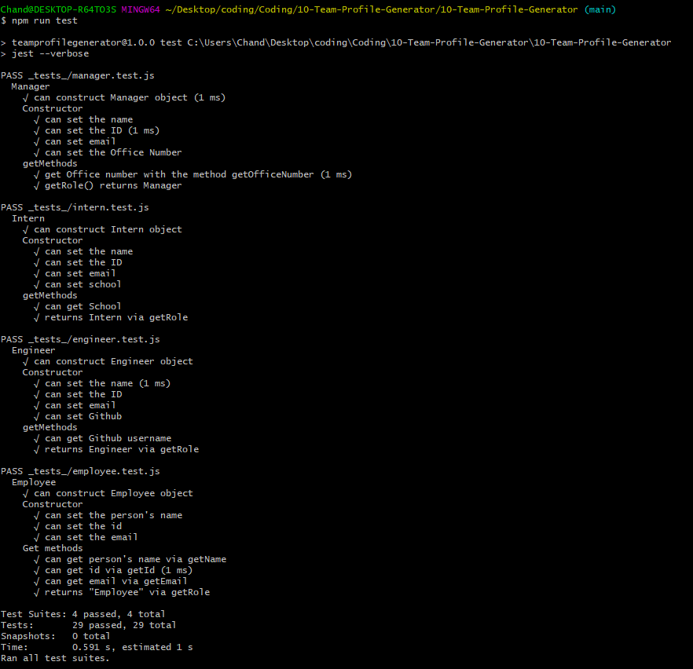

# 10-Team-Profile-Generator

## Overview

This application generates user profiles on a HTML page based on selected queries.

## User Story

```md
AS A manager
I WANT to generate a webpage that displays my team's basic info
SO THAT I have quick access to their emails and GitHub profiles
```

## How to use it

> node index.js

Will ask a series of questions based on role.
Note, your team must have a manager role.


It will create the HTML file in:
>./dist folder


## Demo

[Demo link](https://drive.google.com/file/d/15sZKYhd9cKD-lElHWscS_M8mHqshgHtS/view)

## How to test it

> npm run test




## Technologies used

- Jest
- Node.js
- Inquirer
